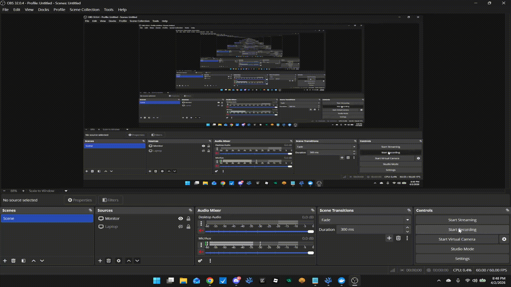

[]()
[](https://github.com/nullclaw/nullclaw)
[]()
[]()



<div align="start">
  
</div>

# Hazel

> [!WARNING]
> This project is still in development and undergoing rigorous testing. It will
> be released through a beta (when it's that stable) or through iterations that
> will be available for people to download and fully use. For the beta version,
> we would appreciate if people are willing to test for bugs as it will help
> further refine the project and anything that is broken before a suitable
> release candidate.
>
> This project is also the foundational structure that is created and used for
> Lotus, which is another project within Hikarian forge that goes above and beyond
> with SLMs (Small/Specific Language Models) and training your own agent orchestration
> framework.
>
> Link: [Hikarian-Forge/Lotus](https://github.com/hikarian-forge/lotus)

> Hazel, Your self-hosted personal assistant, infrastructure-aware and couch-powered.

Hazel is a secure, autonomous AI assistant designed for personal use in a controlled,
self-hosted environment. Built on the Nullclaw framework, she integrates with
OpenRouter, Groq, SearXNG, and Valkey for a complete infrastructure-aware experience.
Hazel operates within her own domain, powered by configurable LLMs, with a focus on
privacy, safety, and a laid-back vibe. No third-party data exposure — your data stays
yours, and Hazel knows the servers like a close friend with root access.

She runs as a Dockerized service stack, perfect for home labs or private networks,
with Discord integration for conversational interaction when desired.

## Table of Contents

- [Hazel](#hazel)
  - [Table of Contents](#table-of-contents)
  - [Architecture \& Features Overview](#architecture--features-overview)
  - [Installation](#installation)
  - [Hazel Environment Variables](#hazel-environment-variables)
  - [Documentation](#documentation)
  - [System Requirements](#system-requirements)
  - [Contact/Socials for Hazel](#contactsocials-for-hazel)
  - [Contributing](#contributing)

## Architecture & Features Overview

Here are the core features of Hazel:

1. **Self-Hosted Stack**: Runs entirely in Docker with Nullclaw as the agent core, Valkey for caching, and SearXNG for private search.
2. **Configurable LLM Backend**: Supports OpenRouter and Groq for cloud models — bring your own keys, keep data private.
3. **Discord Integration**: Optional Discord bot for casual chat and commands in a supervised channel.
4. **Persistent Memory**: SQLite-backed with embeddings for context across sessions.
5. **Tooling Framework**: OpenClaw-based tool execution for safe, audited infrastructure tasks.
6. **Heartbeat Monitoring**: Periodic self-checks to maintain readiness without noise.
7. **Security-First**: Scoped permissions, workspace isolation, and no external side effects without approval.

The architecture leverages a mono-repo structure for simplicity. Detailed docs in `/agent/docs/` explain internals and best practices.

## Installation

> [!NOTE]
> You will need **Docker** and **Docker Compose** to run Hazel. For LLMs, configure OpenRouter or Groq keys.
> If testing specific features, check the docs for status.

To get started with Hazel:

1. Clone the repo:

```bash
git clone https://github.com/hikues-forge/docker-nullclaw.git .
```

2. Set up environment variables:

```bash
cp .env.sample .env
```

Edit `.env` with your keys (see Environment Variables section below).

3. Run the bootstrap script to start fresh containers:

```bash
./scripts/ncs.sh
```

This creates `.env` if missing, tears down old containers, and starts the stack in detached mode.

## Hazel Environment Variables

Hazel's behavior is configured via `.env`. Required variables:

| Env                      | Description                                                                 |
|--------------------------|-----------------------------------------------------------------------------|
| `NULLCLAW_IMAGE`         | Docker image for Nullclaw (defaults to ghcr.io/nullclaw/nullclaw:latest)    |
| `OPENROUTER_API_KEY`     | API key for OpenRouter (if using)                                          |
| `OPENROUTER_DEFAULT_MODEL`| Default OpenRouter model                                                    |
| `GROQ_API_KEY`           | API key for Groq (if using)                                                 |
| `GROQ_DEFAULT_MODEL`     | Default Groq model                                                          |
| `DISCORD_BOT_TOKEN`      | Discord bot token (optional for Discord integration)                       |
| `DISCORD_GUILD_ID`       | Guild ID for Discord bot                                                    |
| `DISCORD_ALLOW_FROM`    | Allowed user ID for Discord commands                                        |

## Documentation

> [!WARNING]
> Documentation is organized in `/agent/docs/`. Key files include:
>
> - `IDENTITY.md`: Hazel's profile and vibe.
> - `SOUL.md`: Core personality and values.
> - `USER.md`: User context and preferences.
> - `AGENTS.md`: Mode switching and rules.
> - `MEMORY.md`: Persistent context storage.
> - `HEARTBEAT.md`: Periodic checks.
> - `TOOLS.md`: Tool usage guidelines.

For inquiries about Hazel, check the docs or reach out via the contact info below.

## System Requirements

- Docker and Docker Compose (latest stable).
- At least 4GB RAM recommended for LLM inference.
- Linux/Windows/Mac with Docker support.

## Contact/Socials for Hazel

> **TODO**: Write proper information about the contact/socials for Hazel.

## Contributing

Contributors are welcome for Hazel. Read [CONTRIBUTING.md](/.github/CONTRIBUTING.md) for guidelines and best practices.

With that being said, all the best, and to the moon 🚀!
